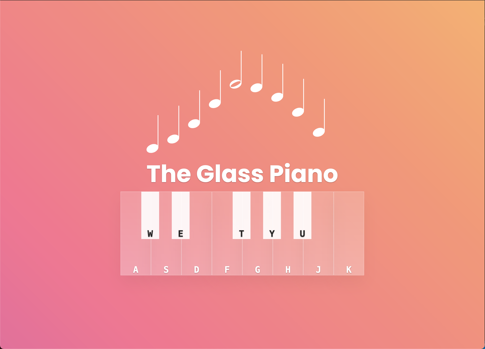

# Piano Sound Board

This project was a piano sound board made for my Web 2 Design class. My goal was to create a simple piano that could be played with the keyboard. This project was made using HTML, CSS, and JavaScript. My goal was to get a better understanding on how to use events in javascript.

[Come play some music!](https://cesar-martinez-sound-board.netlify.app/)

